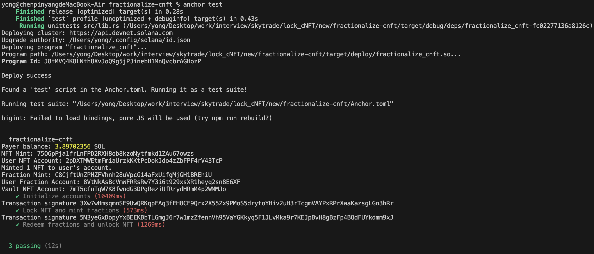

# Project Report: Fractionalize cNFT on Solana

## Introduction

## Table of Contents

1. [Project Overview](#project-overview)
2. [Technical Stack](#technical-stack)
3. [Data Flow](#data-flow)
4. [Security Considerations](#security-considerations)
5. [Smart Contract (On-Chain Program) Implementation(src/lib.rs)](#smart-contract-on-chain-program-implementationsrclibrs)
6. [Testing Strategy(tests/fractionalize-cnft.ts)](#testing-strategytestsfractionalize-cnftts)
7. [Challenges and Solutions](#challenges-and-solutions)
8. [Usage Instructions](#usage-instructions)
9. [Conclusion](#conclusion)

## Project Overview

**Fractionalize cNFT** is a decentralized application (dApp) built on the Solana blockchain, leveraging the Anchor framework. The primary objective of this project is to enable users to fractionalize their Community Non-Fungible Tokens (cNFTs), allowing them to own and trade fractions of a single cNFT. This mechanism democratizes ownership, making high-value cNFTs accessible to a broader audience by breaking them down into smaller, tradable units.

## Technical Stack

1. **Blockchain:** Solana
2. **Framework:** Anchor
3. **Language:** Rust (on-chain), TypeScript (off-chain/testing)
4. **Smart Contract Libraries:** SPL Token (handling token creation and management), Anchor (simplifies Solana smart contract development)
5. **Testing Tools:** Mocha, Chai
6. **Solana CLI:** Managing wallets, deploying programs, and interacting with the Solana network

**Please head to package.json for more dependencies and versions.**

## Data Flow

1. Lock NFT and Mint Fractional Tokens:
   - **Concept**: Split an NFT into smaller fractional tokens, allowing you to hold "shares" of the NFT.
   - **Steps**:
      1. The user calls the `lock_nft_and_mint_fractions` function, specifying the number of fractional tokens they want to mint (e.g., 1000).
      2. The program transfers the NFT from the user’s account to the system's "vault," so the NFT is temporarily held by the vault.
      3. Based on the user's request, the system mints the corresponding number of fractional tokens and sends them to the user. These tokens act like shares of the NFT, with each token representing partial ownership of the NFT.


2. Redeem Fractional Tokens and Unlock NFT:
    - **Concept**: Once you own all the fractional tokens of the NFT, you can return them to the system to redeem the entire NFT.
   - **Steps**:
      1. When the user holds all fractional tokens, they can call the `redeem_fractions_and_unlock_nft` function.
      2. The program burns (destroys) all the fractional tokens held by the user, signifying they have returned all shares.
      3. The system transfers the complete NFT from the vault back to the user's account, restoring the user’s full ownership of the NFT.


## Security Considerations

1. **Program Derived Addresses (PDAs):**
   - Utilized for secure and deterministic management of vaults.
2. **Authority Management:**
   - Clearly defined authorities for minting and transferring tokens.
   - Uses separate keypairs for fraction mint authority and vault authority to enforce separation of duties.
3. **Error Handling:**
   - Comprehensive error handling within the smart contract to prevent unauthorized actions and ensure state integrity.

## Smart Contract (On-Chain Program) Implementation(src/lib.rs)

1. **Key Functions:**
   - **Initialize Accounts:**
     - Sets up the necessary accounts, including the cNFT mint, user's NFT account, fraction mint, user's fraction account, and vault NFT account.
   - **Lock NFT and Mint Fractions:**
     - Transfers the user's cNFT to the vault.
     - Mints a predefined amount of fractional tokens to the user's fraction account.
   - **Redeem Fractions and Unlock NFT:**
     - Burns the user's fractional tokens.
     - Transfers the cNFT back to the user's NFT account from the vault.

2. **Account Structures:**
   - **User Account:** Holds the wallet keypair used for signing transactions.
   - **Vault Account:** A PDA that securely holds the locked cNFT.
   - **Fraction Mint:** An SPL Token mint that represents fractional ownership of the cNFT.
   - **User Fraction Account:** An associated token account that holds the user's fractional tokens.
   - **Fraction Mint Authority:** Responsible for minting fractional tokens.
   - **Vault Authority:** Manages the vault's operations.

## Testing Strategy(tests/fractionalize-cnft.ts)
1. **Test Cases:**
   - **Initialize Accounts:**
     - Goal: Ensure all necessary accounts are correctly initialized and funded.
     - Steps:
       ```
        1. Load the payer's existing wallet.
        2. Confirm the wallet has sufficient SOL balance.
        3. Create the NFT mint and associated accounts.
        4. Mint a cNFT to the user's NFT account.
        5. Create the fraction mint and user's fraction account.
        6. Set up the vault NFT account.
       ```

   - **Lock NFT and Mint Fractions:**
     - Goal: Test the functionality of locking a cNFT and minting fractional tokens.
     - Steps:
       ```
       1. Invoke the lock_nft_and_mint_fractions instruction.
       2. Verify that the cNFT is transferred to the vault.
       3. Confirm the user's NFT account balance is zero.
       4. Check that the user received the correct amount of fractional tokens.
       ```

   - **Redeem Fractions and Unlock NFT:**
     - Goal: Test the functionality of redeeming fractional tokens to unlock the original cNFT.
     - Steps:
       ```
       1. Invoke the redeem_fractions_and_unlock_nft instruction.
       2. Verify that the cNFT is returned to the user's NFT account.
       3. Confirm the vault's NFT account balance is zero.
       4. Ensure the user's fractional token balance is zero.
       5. Check that the total supply of fractional tokens is zero.
       ```

## Challenges and Solutions

1. **Undefined publicKey Properties:**
   - **Solution:**
     - Ensure Proper Initialization: Refactored test script to load an existing, funded wallet as the payer.
     - Sequential Execution: Ensured that account initialization is completed before proceeding to subsequent tests.
     - Enhanced Logging: Added logs to monitor variable states.

2. **Testing Environment Configuration:**
   - **Solution:**
     - Correct Anchor Provider Setup: Configured the Anchor Provider to use an existing wallet and explicitly connect to Devnet.
     - Anchor.toml Configuration: Verified that the file correctly points to Devnet and references the appropriate wallet file.

3. **Module `"@coral-xyz/anchor"` Locally Declares `'NodeWallet'` but Does Not Export It:**
   - **Issue:**
      ```typescript
      import { Program, web3, NodeWallet } from "@coral-xyz/anchor";
      ```
   - In the original @project-serum/anchor package, NodeWallet was an exported class used for managing wallets in a local environment.
After migrating to the new package name @coral-xyz/anchor, NodeWallet was either removed or renamed, causing it to no longer be exported from the package.

   - **Solution:**
     - Utilize the default wallet provided by AnchorProvider instead of directly importing and using NodeWallet.

4. **'tokenProgram' Property Does Not Exist in the accounts Object**
   - **Issue:**
     - In the latest version of Anchor, certain common programs (like systemProgram, tokenProgram, rent, etc.) are treated as implicit accounts and do not need to be explicitly specified in the accounts object. The tokenProgram is not listed in the program's IDL accounts, causing the TypeScript compiler to throw an error when it's referenced.

   - **Solution:**
        ``` typescript
            const tx = await program.methods
        .lockNftAndMintFractions(fractionAmount)
        .accounts({
            user: payer.publicKey,
            userNftAccount: nftTokenAccount,
            vaultNftAccount: vaultNftAccount,
            fractionMint: fractionMint,
            userFractionAccount: userFractionAccount,
            fractionMintAuthority: fractionMintAuthority.publicKey,
            tokenProgram: TOKEN_PROGRAM_ID, // Needs to be removed
        })
        .signers([fractionMintAuthority])
        .rpc();
        ```
## Usage Instructions

1. **Prerequisites:**
   - Solana CLI
   - Node.js and npm
   - Anchor Framework
   - Rust

2. **Steps:**
   - **Clone the Repository:**
     ```
     git clone https://github.com/YangIsCoding/Fractionalize-cNFT-on-Solana.git
     cd fractionalize-cnft
     ```
   - **Install Dependencies:**
     ```
     npm install
     ```
   - **Build the Program:**
     ```
     anchor build
     ```
   - **Configure Anchor.toml:**
     ```toml
     [programs.devnet]
     fractionalize_cnft = "J8tMVQ4K8LNth8XvJoQ9g5jPJinebH1MnQvcbrAGHozP"

     [provider]
     cluster = "devnet"
     wallet = "/Users/yong/.config/solana/id.json"

     [scripts]
     test = "npx mocha -r ts-node/register -t 1000000 tests/**/*.ts"
     ```

     Change the wallet Path to your own.
   - **Fund Wallet:** Visit [faucet.solana.com](https://faucet.solana.com/) to obtain Solana devnet tokens.
   - **Run Tests:**

     ```
     anchor test
     ```

     

**Important: If you deploy the smart contract once again, you should change the program_id in Anchor.toml and lib.rs**

## Conclusion

The Fractionalize cNFT project successfully demonstrates the capability to fractionalize Community Non-Fungible Tokens on the Solana blockchain, providing a mechanism for broader and more accessible ownership. By leveraging the Anchor framework, the project benefits from streamlined smart contract development, robust testing practices, and efficient deployment processes. 

Through enabling fractional ownership, this project not only enhances the liquidity and tradability of high-value cNFTs but also paves the way for innovative use cases in decentralized finance (DeFi), digital asset management, and beyond. Future developments, including user interfaces, advanced governance mechanisms, and comprehensive security audits, will further augment the project's utility, user experience, and security, fostering greater adoption and trust within the community.
